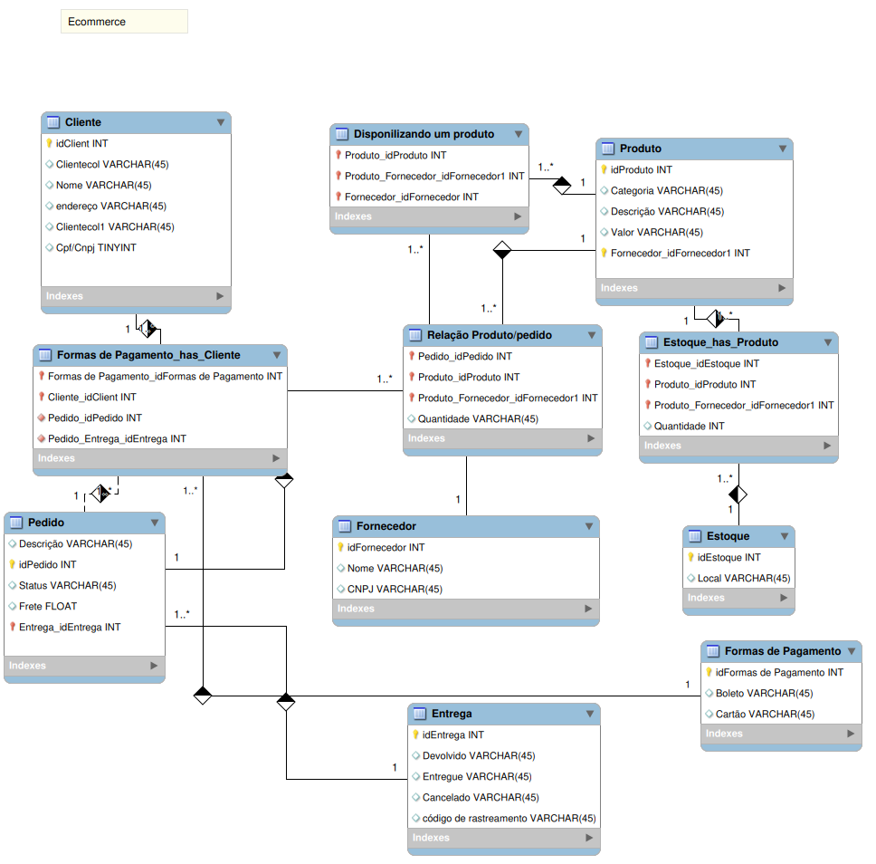

<!DOCTYPE html>
<html>
<head>
	<meta charset="utf-8">
	<meta name="viewport" content="width=device-width, initial-scale=1">

</head>
<body>
	<h1>Database for an e-commerce using MySQL and Workbench</h1>
	<h3>
Hello!
</h3>
	

	<u> 
I created a database model for an e-commerce using MySQL and Workbench. The model includes tables for products, customers, orders, and payments. Additionally, I used several skills from Workbench to optimize the database performance and ensure data integrity.</u>

The products table includes information about the product name, description, price, and stock. The customers table stores personal information of the customers, such as name, address, phone number, and email. The orders table contains information about the orders of the customers, such as date, status, and delivery address. The payments table stores information about the financial transactions, including the credit card number and the value of the order.

By creating this model, I improved my skills in database modeling and writing efficient SQL queries. I also learned to use various Workbench tools to optimize the database performance and improve data security.

<i>
I am sharing the model of my project here, hope you like it!
</i>

</body>
</html>

<!DOCTYPE html>
<html>
<head>
	<meta charset="utf-8">
	<meta name="viewport" content="width=device-width, initial-scale=1">

</head>
<body>
	<h1>Banco de dados para um e-commerce utilizando MySQL e Workbench</h1>
	<h3>
Olá!
</h3>

Eu criei um modelo de banco de dados para um e-commerce utilizando MySQL e Workbench. O modelo inclui tabelas para produtos, clientes, pedidos e pagamentos. Além disso, utilizei várias habilidades do Workbench para otimizar o desempenho do banco de dados e garantir a integridade dos dados.

A tabela de produtos inclui informações sobre o nome, descrição, preço e estoque dos produtos. A tabela de clientes armazena informações pessoais dos clientes, como nome, endereço, telefone e e-mail. A tabela de pedidos contém informações sobre os pedidos dos clientes, como data, status e endereço de entrega. A tabela de pagamentos armazena informações sobre as transações financeiras, incluindo o número do cartão de crédito e o valor do pedido.

Ao criar esse modelo, aprimorei minhas habilidades em modelagem de banco de dados e em escrever consultas SQL eficientes. Também aprendi a utilizar várias ferramentas do Workbench para otimizar a performance do banco de dados e melhorar a segurança dos dados.

Compartilho aqui o modelo do meu projeto, espero que gostem!
	

